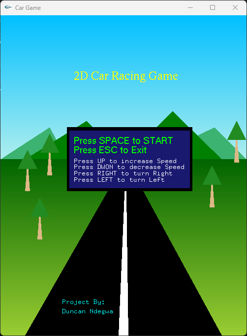
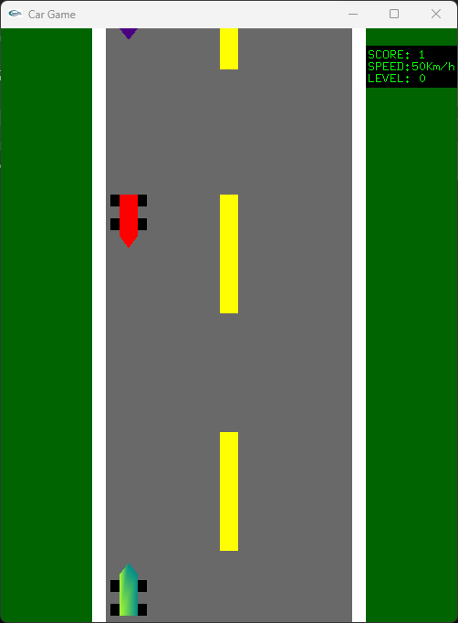

# GLUT Car Game

A simple 2D car game built using OpenGL Utility Toolkit (GLUT) in C++. The game includes basic gameplay elements like controlling the car to avoid obstacles and score points.

## Features
- Move the car left and right to avoid incoming obstacles.
- Dynamic increase in speed as the game progresses.
- Game over screen when the car hits an obstacle.
- Simple, fun, and interactive game built from scratch in C++ using OpenGL.

## Screenshots

### Home Screen


### Gameplay


### Game Over Screen


## Installation & Setup

1. **Clone the repository**:
   ```bash
   git clone https://github.com/whizydan/glut-car-game
